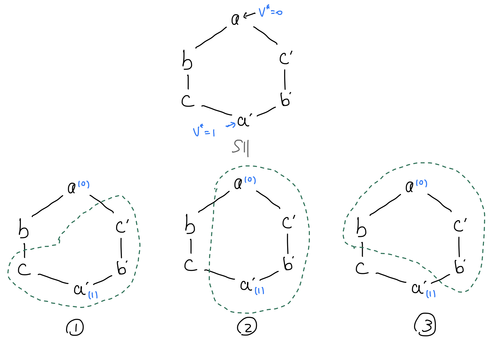

# Consensus 

1. Fundamental assumptions: digital signature and point-to-point communication \@ref(def:fundAssumptions). 
2. Other assumptions: permissioned setting \@ref(def:permissionSetting), public-key infrastructure \@ref(def:pki), and synchronous model \@ref(def:syncModel). 
3. Single-shot concensus: **Byzantine Broadcast** \@ref(def:bbSetup) and **Byzantine Agreement** \@ref(def:baSetup). 
    - **Dolev-Strong** (theorem \@ref(thm:dolevStrongResult)): BB is solvable under permissioned setting, synchronous model, and PKI assumptions regardless of Byzantine portion. 
    - Equivalence of BA and BB when $f<n/2$: theorem \@ref(thm:singleShotReduction). 
    - **FLM Impossibility Result** (theorem \@ref(thm:flm)): synchronous BB is not solvable for $f\geq n/3$ <u>in the absence of PKI</u>. 
4. Multi-shot concensus: **State-Machine Replication** \@ref(def:smrSetup). Reduction to BB under permissioned setting and synchronous model (theorem \@ref(thm:smrBBReduction)). 

## Fundamental assumptions {#fundAssump -}

:::{.definition #fundAssumptions name="fundamental assumptions of blockchains"}
Throughout these notes, we assume the existence of: 

1. A correct, secure digital signature scheme (definition \@ref(def:digSig) below). 
    - Allows node $A$ to verify $B$'s claim that "node $C$ said ...". 
2. Point-to-point communication (internet). Minimal assumptions on latency / reliability. 
:::

:::{.definition #digSig name="digital signature scheme"}
A **digital signature scheme** consists of three algorithms, $\m{Gen}, \m{Sign}, \m{Vf}$ satisfying: 

- $\m{Gen}(1^\lambda) = \m{pk, sk}$: consumes a security parameter $\lambda$ to generate a (public, secret)-key pair. 
- $\m{Sign}(\m{sk}, m) = \sigma$: consumes a secret key and a message to obtain a signature. 
- $\m{Vf}(\m{pk}, m, \sigma) = \{0, 1\}$: verification consuming public key, message, and signature to output acceptance or rejection. 

A digital signature scheme $(\m{Gen}, \m{Sign}, \m{Vf})$ is: 

1. **correct** if $\m{Vf}(\m{pk}, m, \m{Sign}(\m{sk}, m)) = 1$. 
2. **secure** if no poly-$\lambda$ adversary can forge an acceptable signature reliably. 
:::

Note that the signature must be message-dependent, else signatures can be copied to sign other messages. 

We consider **nodes**, which are local computers which can run code and communicate with each other in a point-to-point fashion. A **protocol** is an algorithm which a node can run. 

:::{.definition #permissionSetting name="permissioned setting"}
The set of nodes responsible for running the protocol is known up front. In other words, the protocol description itself can reference specific nodes which are running it. 

- For a company managing database copies, permissioned setting is natural. 
- Bitcoin and Ethereum protocols are likely permissionless. 
:::

:::{.definition #pki name="public key infrastructure"}
Stronger assumption than permissioned setting: all nodes have distinct public-private key pairs, and public keys are common knowledge. 
:::

:::{.definition #syncModel name="synchronous model"}
The synchronous model, nodes have: 

1. **Shared global clock**: nodes can agree on a global timestep. 
2. **Bounded message delays**: w.l.o.g., message sent at time $t$ will be delivered by $t+1$. 
:::


## Single-shot consensus {#singleShot -}

Consider a sequence of $[n]=\{1, 2, \dots, n\}$ nodes. Given a protocol, nodes are of the following types; we may know a bound on the number of nodes in each type, but we do not know the nodes' identity:  

- **Honest**: executes the prescribed protocol. This includes both the _validity_ and _timeliness_ of messages. 
- **Byzantine**: behaves arbitrarily; byzantine nodes can collude. 

:::{.definition #bbSetup name="Byzantine Broadcast"} 
We're working in a permissioned setting. 

1. One node is the **sender** and the other non-senders. The sender's identity is common knowledge. 
2. The sender has access to _private input_ $v^*\in V$. 

A solution to the Byzantine broadcast problem must satisfy: 

1. **Termination**: every honest node $j$ eventually halts with some output $v\in V$. 
2. **Agreement**: all honest nodes halt with the same output, irrespective of whether the sender is honest. 
3. **Validity**: if the sender is honest, then the common output of honest nodes is $v^*$.

Note that agreement without validity is trivial (all nodes output $\perp$), as well as validity without agreement (echo sender). Also note that validity implies agreement when the sender is honest. 
:::

:::{.definition #convMessDS name="convincing message"}
Node $j$ is convinced of value $v$ at time $t$ if it receives _a message_ prior to $t$ that: 

1. References $v$. 
2. Signed first by the sender. 
3. Also signed by at least $t-1$ distinct non-sender nodes apart from $j$. 
:::

:::{.definition #dolevStrong name="Dolev-Strong protocol"}
At $t=0$, the sender sends $v^*$ to all nodes and outputs $v^*$. Next repeat for $t=1, \dots, f+1$: 

- If a non-sender $j$ is newly convinced of $v$ at time $t$ by message $m$, the node adds its own signature to $m$ and sends $(m, s)$ to all other non-senders. 

For each nonsender, if outputs $v$ it's convinced by exactly one $v$, else outputs $\perp$. 
:::

:::{.theorem #dolevStrongResult name="Dolev-Strong"}
Byzantine Broadcast \@ref(def:bbSetup) is solvable under: 

- Permissioned setting with $n$ nodes \@ref(def:permissionSetting) under PKI assumptions \@ref(def:pki). 
- Synchronous communication \@ref(def:syncModel). 
- Arbitrary bound on Byzantine nodes. Note that the $f=n, n-1$ case satisfies validity and agreement trivially. 
:::

<details>
<summary>Proof idea: honest nodes broadcast what they're convinced by, and protocol runs for long enough so that there're not enough Byzantine nodes to collude</summary>
Let's first prove validity; considering an honest sender (validity only has bite for honest senders), an honest node can only ever be convinced of $v^*$ since convincing messages has to be signed by the sender, and Byzantine nodes can't forge the sender's signature. Honest non-senders are also convinced by the honest sender at $t=0$. 

Proceeding to agreement: validity implies agreement if the sender is honest. Assuming Byzantine sender, we prove that when protocol terminates, _all honest non-senders are convinced of the same set of values_. Assuming that an honest non-sender $j$ is _newly_ convinced at: 

- $t\leq f$: this implies that the sender and $t-1$ non-senders signed the message. Then $j$ proceeds to sign the message and broadcast; this message convinces all non-senders at $t+1$. 
- $t=f+1$: this implies that the Byzantine sender and $t-1=f$ non-senders signed the message. Since there're at most $f$ Byzantine nodes, at least one honest non-sender has signed the message, so all other nodes are convinced. 

Note that the $t=f+1$ round of checks is paramount; suppose we terminate at time $t$, then the Byzantine nodes can collude to produce a convincing message to one of the honest nodes, which does not have time to broadcast this to other honest nodes. 
</details>

:::{.definition #baSetup name="Byzantine Agreement"}
Similar to Byzantine broadcast \@ref(def:bbSetup), but each node has private bit $b_j\in \{0, 1\}$ with at most $f$ Byzantine nodes. Solution must satisfy termination and: 

1. Agreement: all honest nodes output the same bit. 
2. Validity: when all honest nodes have the same private input, they all terminate with $b$. 
:::

:::{.theorem #singleShotReduction name="deterministic BA-BB reduction"}
Given $f<n/2$, there exists a deterministic BA solution iff there exists a deterministic BB solution. 
:::
<details>
<summary>Proof</summary>
Given $\pi$ solving the BB problem, construct a BA protocol as follows: 

1. Nodes take turn to Byzantine-broadcast their private input $b_j$. 
2. Output majority value. 

- Validity: when all nodes have the same private input $b$, their private inputs are consistently broadcasted to all other honest nodes _since $\pi$ is valid_. Since $f<n/2$, honest nodes have consistent output by majority vote. 
- Agreement: all honest nodes have the same "perception" of other nodes, so majority votes are consistent. 

Given a BA protocol $\pi$, construct a BB protocol as follows: 

1. $T=0$: sender sends $v^*$ to all non-senders. 
2. Everyone runs $\pi$ on their received bits. 

- Agreement follows from $\pi$ satisfying agreement. 
- Validity: when sender is honest, all honest nodes receive $v^*$. Validity follows from BA validity of $\pi$. 
</details>

<details>
<summary>Illustrative questions</summary>
Assume $n\geq 3$ and consider the following protocol: 

1. $t=0$: sender sends private bit with signature to all other nodes. The sender terminates with its own private bit. 
2. $t=1$: every non-sender node $j$ echoes what it heard from the sender to all non-sender nodes. 
3. $t=2$: every non-sender node collects all the votes it has received and outputs majority vote. 

Several questions:

1. For $f=1$ does this protocol satisfy agreement? 
    - Yes. Suppose sender Byzantine, the honest non-sender nodes will agree on their votes (i.e. what they heard from the sender). Suppose a non-sender Byzantine, they're unable to overturn $n-1>1$ consistent votes. 
2. For $f=1$, does this protocol satisfy validity?
    - Yes. Honest sender broadcasts $v^*$ to $n-2$ other honest nodes, so there are $n-1>1$ honest votes contributing to the correct value. 
3. For $f=2$, does this protocol satisfy agreement?
    - No. Consider $n=4$ with 1 Byzantine sender and non-sender. Sender sends $0, 1$ to honest nodes $a, b$, respectively, and Byzantine non-sender echoes message $0, 1$ to $a, b$ respectively. Then $a, b$ outputs $0, 1$. 
4. For $f=2$, does protocol satisfy validity? 
    - Yes. Byzantine nodes cannot forge alternative vote. 
5. Recall Dolev-Strong protocol. Suppose we stop it one step earlier with nodes committing to output at time $f$ rather than $f+1$. Does it continue to satisfy agreement? 
    - No. Consider Byzantine sender with $f-1$ Byzantine non-senders. At time $f$, they can collude to produce a convincing message to send to a select subset of honest non-senders, while appearing honest to everyone else. 
6. Does the protocol in (5) satisfy validity? 
    - Yes. Non-senders cannot forge signatures. 
</details>

## State-machine replication {#smr -}

Byzantine broadcast is also known as a **one-shot consensus** problem. We proceed to **multi-shot consensus** and demonstrate reduction to Byzantine Broadcast. 

:::{.definition #smrSetup name="state-machine replication"} 
We're working in a permissioned setting. Each honest node receives an incoming stream of requests and attempts to make this common knowledge; it also maintains an **append-only log**. A solution should satisfy 

1. **Liveliness**: every request to an honest node is eventually included in the log of honest nodes. 
2. **Consistency**: at any time, the log of each honest replica are pairwise prefixes (i.e. order cannot be messed up). 
:::

:::{.theorem #smrBBReduction name="SMR reduces to BB"}
In a synchronous and permissioned setting with PKI, given a BB protocol $\pi$ which terminates in time $T$, there exists a solution to SMR. At each step $0, T, 2T, 3T, \dots$ 

1. Define the leader node by round-robin ordering. 
2. The leader collects its own not-yet-included requests and appends them to its local log. 
3. The leader broadcasts the updated local log via $\pi$. 
4. When $\pi$ terminates, every node $j$ appends its not-yet-included requests to the received log. 
:::

<details>
<summary>BB (validity, agreement)$\implies$ SMR (liveliness, consistency)</summary>
Liveliness: request submitted to $j$ will be included in the log of all honest nodes when it's $j$'s term to be the leader, by $\pi$'s _validity_ property. 

Consistency: $\pi$'s consistency implies that nodes execute the appending operation consistently. 

## FLM impossibility result {#flmImpossible -}

The pivotal theorem below does not contradict Dolev-Strong \@ref(thm:dolevStrongResult). 

:::{.theorem #flm name="FLM impossibility result"}
In a synchronous model with $f\geq n/3$, there is no Byzantine broadcast protocol satisfying termination, agreement, and validity. 
:::

Proof: hexagon argument for $n=3, f=1$ plus reduction 

For simplicity, consider $n=3$ with nodes $a, b, c$. Consider the hexagon connection below with $\pi$ running on each node; note that the hexagon type-checks since each triple of contiguous nodes only involve one sender and two non-senders: 

```{r fig:hexagonFLM, echo=FALSE, out.width="100%"}

```

Crucially, the hexagon setup with 6 honest nodes is equivalent to three Byzantine setups, with the Byzantine node simulating the encircled honest nodes. Scenario $1$ forces $a=b=0$, scenario $2$ $b=c=0$, and scenario $c$ $c=a'=0$ but $a'=-1$, so either agreement or validity has to be violated. 

Proceeding to the general case, we provide a reduction that BB protocol for $(n'=3k, f'=k)$ provides a BB protocol for $(3, 1)$: given a $(3k, k)$ BB protocol, let node $j\in [3]$ simulate nodes $[(j-1)k, jk]$ in $\pi$. Since each node simulates $k$ nodes, there are at most $k$ Byzantine nodes in the simulated protocol, so validity and consistency follows. 

A $(3k+1, k+1)$ protocol provides similar reduction: even if single node simulating $k+1$ nodes is Byzantine, there are at most $kf+1$ Byzantine nodes in the simulated protocol. Finally, a $(3k+2, k+1)$ protocol reduces for each of the physical three nodes simulating $(k, k+1, k+1)$ virtual nodes. Even if the only physical Byzantine node simulates $k+1$ virtual nodes, there're only $k+1$ Byzantine nodes in the extended setup. 